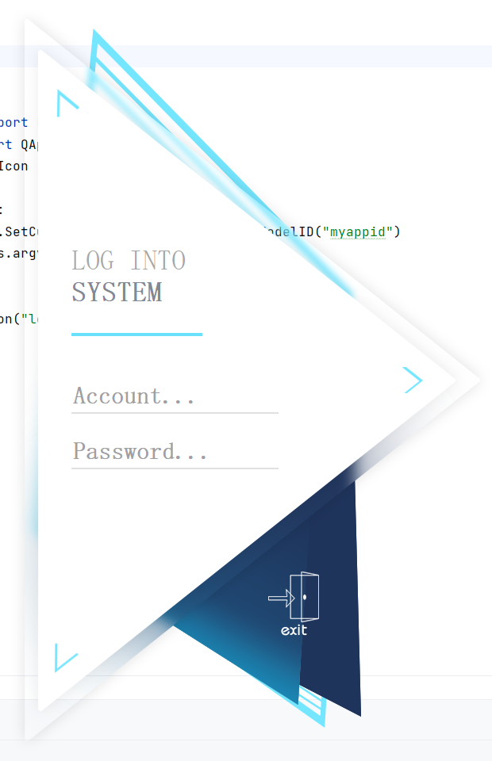

  

<h1 align="center">
  PyQt-Advanced-Interface
</h1>

  兴趣所向系列，Qt/PyQt高级界面开发。

  
  
  <!---
  
  
  --->

  <a href="README.md">English</a> | 简体中文

## 预览
### 样例1:

  

#### 描述：
无边框不规则透明高级登录界面(毕业设计时期开发)，背景使用ps临摹；软件登录、注册切换和退出时有淡入淡出动画，输入框有输入反馈，输入有误时有抖动交互动画反馈，详细可观看[**doc/dome.mp4**](https://github.com/hailhydra21/PyQt-Advanced-Interface/raw/master/doc/dome.mp4)

<!-- ## 参考
+ [**title**:text](url) 
-->
